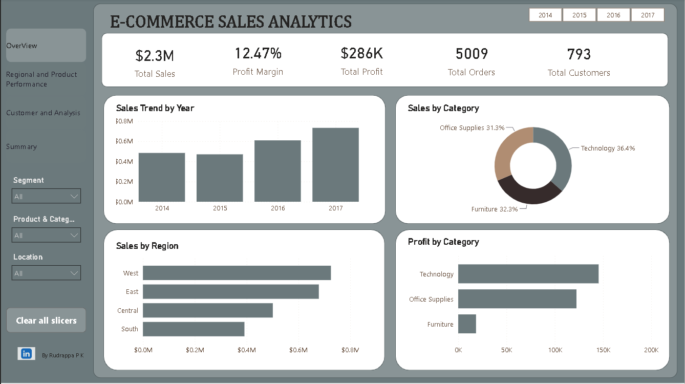

# 📊 E-Commerce Sales Analytics

> **End-to-end Data Analytics project using Python, PostgreSQL, SQL, and
> Power BI to transform retail transaction data into actionable business
> insights.**

[](https://www.python.org/)
[](https://pandas.pydata.org/)
[](https://www.postgresql.org/)
[](https://powerbi.microsoft.com/)

## 📌 Project Overview

This project analyzes **9,994 retail transactions** from the Sample
Superstore dataset to understand sales performance, profitability,
customer behavior, product performance, regional trends, discount
impact, and shipping efficiency.

**Workflow:** Python → PostgreSQL → SQL → Power BI → Business Insights

The goal is to identify not only what happened, but where the business
can improve profitability and operational performance.

## 🎯 Business Objective

The analysis answers questions such as:

-   Which categories and products generate the most sales?
-   Which products and sub-categories are most profitable?
-   Where are the major profitability problems?
-   Which customers generate the highest revenue and profit?
-   How do discounts affect profitability?
-   Which regions and states perform best?
-   How do sales change over time?
-   Which shipping modes are fastest and most commonly used?
-   What actions could improve overall profitability?

## 📊 Key Performance Indicators

  KPI                                 Result
  -------------------------- ---------------
  💰 Total Sales                 **\$2.30M**
  📈 Total Profit              **\$286.40K**
  📊 Profit Margin                **12.47%**
  🛒 Total Orders                  **5,009**
  👥 Total Customers                 **793**
  🚚 Average Shipping Time     **3.91 days**
  📦 Transactions Analyzed         **9,994**

## 🛠️ Technology Stack

  Technology            Purpose
  --------------------- ------------------------------------------
  🐍 **Python**         Data cleaning, transformation, and EDA
  **Pandas**            Data manipulation and analysis
  **Matplotlib**        Exploratory visualization
  🐘 **PostgreSQL**     Database storage and querying
  **SQL**               Business analysis
  📊 **Power BI**       Interactive dashboard
  **DAX**               KPI calculations and analytical measures
  🔧 **Git & GitHub**   Version control and portfolio management

## 🔎 Analysis Approach

### 1. Python --- Data Cleaning & EDA

Performed:

-   Dataset profiling
-   Missing-value and duplicate analysis
-   Data type validation
-   Date standardization
-   Data transformation
-   KPI calculations
-   Category and sub-category analysis
-   Product and customer analysis
-   Regional and state analysis
-   Discount analysis
-   Monthly, quarterly, and yearly trends
-   Shipping analysis
-   Profit-margin analysis

Notebook: `Notebook/EDA.ipynb`

### 2. PostgreSQL & SQL --- Business Analysis

The cleaned data was loaded into PostgreSQL and analyzed using:

-   `WHERE`
-   `GROUP BY`
-   `HAVING`
-   `CASE WHEN`
-   Date functions
-   CTEs
-   Window functions
-   Views
-   Ranking and top-N analysis
-   Running totals
-   Year-over-year analysis
-   Month-over-month analysis
-   Customer and product profitability analysis

SQL files: `SQL/`

## 📊 Power BI Dashboard

The project contains a **4-page interactive Power BI dashboard**.

### Page 1 --- Executive Overview

-   Total Sales
-   Total Profit
-   Profit Margin
-   Orders
-   Customers
-   Sales by Category
-   Profit by Category
-   Regional Sales
-   Yearly Sales Trends

### Page 2 --- Regional & Product Performance

-   Regional performance
-   State-level performance
-   Product profitability
-   Sub-category performance
-   Top and bottom performing states

### Page 3 --- Customer & Product Analysis

-   Top 10 customers
-   Customer sales and profitability
-   Sales by segment
-   Category trends
-   Monthly and day-of-week sales patterns
-   Product-level analysis

### Page 4 --- Executive Business Summary

-   Key KPIs
-   Major findings
-   Business challenges
-   Recommended actions

### Dashboard Preview




## 💡 Key Business Insights

### 📈 Sales Performance

-   Total sales were approximately **\$2.30M**.
-   **2017** was the highest-performing year by sales.
-   The **West region** generated the highest regional sales at
    approximately **\$725K**.
-   **Technology** was the strongest sales category, contributing
    approximately **36.4%** of total sales.
-   **Phones** were the highest-selling sub-category at approximately
    **\$330K** in sales.
-   **California** was the highest-selling state at approximately
    **\$458K** in sales.

### 💰 Profitability

-   Total profit was approximately **\$286.40K**.
-   Overall profit margin was **12.47%**.
-   **Copiers** generated the highest sub-category profit at
    approximately **\$55.6K**.
-   **Tables** were the weakest sub-category, generating approximately
    **-\$17.7K** in profit.
-   **Texas** showed a significant profitability problem despite strong
    sales.
-   **Labels** had the highest sub-category profit margin at
    approximately **44.42%**.
-   **Tables** had the lowest sub-category profit margin at
    approximately **-8.56%**.

### 👥 Customer Analysis

The analysis highlights an important distinction between **revenue and
profitability**:

-   Some customers generate high sales but relatively low or negative
    profit.
-   Customer value should therefore be evaluated using both sales and
    profit.
-   **Tamara Chand** was identified as a highly profitable customer,
    with approximately **\$9K profit** and a **47.14% profit margin**.
-   **Sean Miller** generated approximately **\$25K in sales** but
    around **-\$2K in profit**, highlighting a customer-level
    profitability opportunity.

### 🚚 Shipping

-   **Standard Class** was the dominant shipping mode.
-   **Same Day** was the fastest shipping mode.
-   Average shipping time was approximately **3.91 days**.

## 🚨 Key Business Challenges

1.  Loss-making products and sub-categories.
2.  High discounts affecting profit margins.
3.  Significant profitability differences across states.
4.  High-revenue customers/products that do not always generate strong
    profit.
5.  Opportunities to optimize shipping and operational costs.

## 💼 Business Recommendations

### 1. Optimize Discount Strategies

Review high-discount transactions and reduce discounts that
significantly reduce margins.

### 2. Improve Product-Level Profitability

Investigate loss-making products, especially weak sub-categories such as
Tables, and review pricing, costs, and discount structures.

### 3. Focus on High-Margin Products

Prioritize products and categories that consistently generate stronger
margins.

### 4. Investigate Underperforming States

Analyze states such as Texas to identify whether pricing, discounting,
product mix, or shipping costs are driving negative profit.

### 5. Use Customer Profitability Segmentation

Evaluate customers using both revenue and profit instead of sales alone.

### 6. Optimize Shipping Decisions

Balance delivery speed and operational cost to improve customer service
without unnecessarily increasing expenses.

## 📁 Project Structure

``` text
E-Commerce-Sales-Analytics/
│
├── Dashboard/
│   └── SuperStore_Dashboard.pbix
│
├── Data/
│   ├── Sample_Superstore.csv
│   ├── Sample_Superstore_Clean.csv
│   └── Sample_Superstore_PostgreSQL.csv
│
├── Notebook/
│   └── EDA.ipynb
│
├── Report/
│   └── Ecommerce_Sales_Analytics_Business_Report.docx
│
├── SQL/
│   ├── Business Problem Questions.sql
│   ├── CTEs.sql
│   ├── Case_when.sql
│   ├── Data Function.sql
│   ├── Filtering.sql
│   ├── Groupby.sql
│   ├── Having.sql
│   ├── Importing data.sql
│   ├── View.sql
│   └── Windows_function_qn.sql
│
├── Screenshots/
│   ├── Customer_and_product_analysis.png
│   ├── Overview_page.png
│   └── Regional_and_product_performance.png
│
├── .gitignore
└── README.md
```

## 📄 Business Report

A detailed executive business report is available at:

`Report/Ecommerce_Sales_Analytics_Business_Report.docx`

It covers the executive summary, business objective, data preparation,
methodology, KPI analysis, sales, profitability, products, regions,
customers, shipping, time trends, challenges, recommendations, and
conclusion.

## 📌 Project Outcome

This project demonstrates the complete journey from **raw data to
business decision-making**:

``` text
DATA
 ↓
Clean & Validate
 ↓
Analyze
 ↓
Query
 ↓
Visualize
 ↓
Interpret
 ↓
Recommend
```

### Main Takeaway

> **High sales do not necessarily mean high profitability.**

The analysis highlights the importance of managing **discounts, product
margins, regional performance, customer profitability, and operational
efficiency** together rather than focusing on sales alone.

## 👨‍💻 Author

### **Rudrappa Prakasha Kattimani**

**Aspiring Data Analyst**

**Skills:** Python • SQL • PostgreSQL • Power BI • Data Analysis • Data
Visualization

GitHub: [ravi8147-2005](https://github.com/ravi8147-2005)

------------------------------------------------------------------------

⭐ **If you find this project useful, feel free to explore the analysis,
SQL queries, and Power BI dashboard.**
